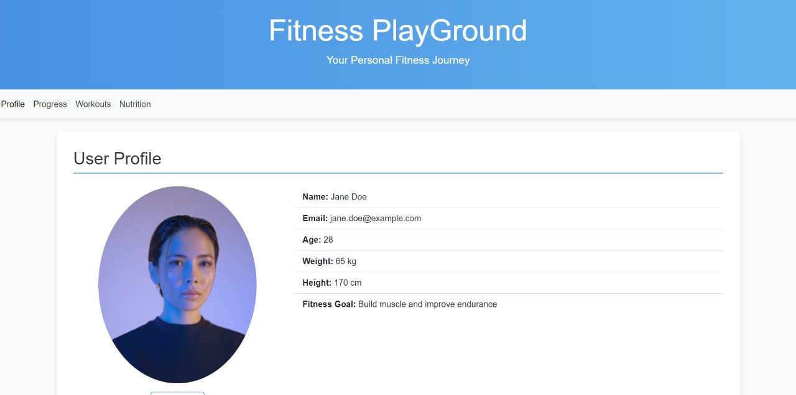
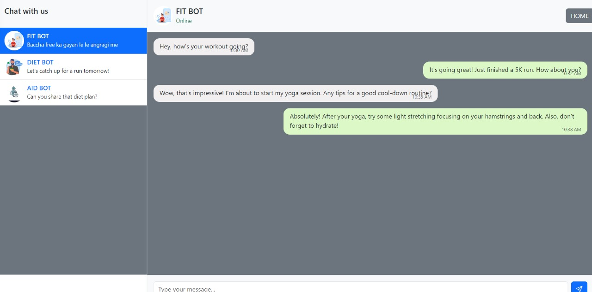

# Fitness PlayGround - Prakash Choudhary

## Project Description
Fitness PlayGround is a comprehensive fitness platform developed by HackHounds for AMUHACKS4.0. The web application provides:
- Yoga resources and tutorials
- E-commerce functionality for fitness products
- Chat/query system for fitness advice
- Progress tracking features
- User authentication with premium and regular tiers

## Key Features
- **User Authentication**: Separate login systems for premium users and regular customers
- **E-commerce**: Shopping cart and order placement functionality
- **Fitness Resources**: Yoga postures, principles and tutorials
- **Chat System**: Query/advice system for fitness guidance
- **Progress Tracking**: Tools to monitor fitness journey
- **Responsive Design**: Built with Bootstrap for all device compatibility

## Tech Stack
- **Frontend**: HTML5, CSS3, Bootstrap
- **Backend**: PHP
- **Database**: MySQL
- **Server**: XAMPP

## How to Run the Project
1. Install XAMPP and start Apache and MySQL services
2. Clone this repository into your `htdocs` folder
3. Import the database schema (if available)
4. Access the application via `http://localhost/Hackhounds_AMUHACKS4.0/`

## Team Member
- Prakash Choudhary (prakash18052006@gmail.com)

## Screenshots

### Homepage

### Login Screens

### Profile Section

### Shopping Section

### Chat Interface

### Yoga Resources

### faqs

## Demo Video
[Watch the Demo on Youtube](https://youtu.be/UnWHG3e0wZ0?si=WVEBaRD7m7hb7R8k)

#AMUHACKS4.0 #CSSAMU #AMU
